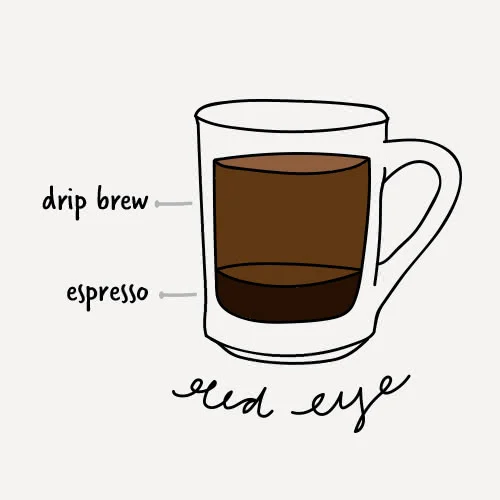

<!DOCTYPE html>
<!DOCTYPE html>
<html lang="en">
  <head>
    <meta charset="UTF-8" />
    <meta http-equiv="X-UA-Compatible" content="IE=edge" />
    <meta name="viewport" content="width=device-width, initial-scale=1.0" />
    <link rel="stylesheet" href="index.css" />
    <title>E-commerce</title>
  </head>
  <body>
    <section class="Home__page" id="home">
      <nav>
        <h1 class="logo"> Coffee </h1>
        <ul class="nav-ul">
          <li class="nav-li"><a  href="#home">Home</a></li>
          <li class="nav-li"><a onclick="alert('This is a sample website')" href="#">About us</a></li>
          <li class="nav-li"><a onclick="alert('This is a sample website')" href="#">Contact</a></li>
          <li class="nav-li"><a onclick="alert('This is a sample website')" href="#">Services</a></li>
        </ul>
      </nav>
      

        <h1 class="home-page-header"> Good to the Last Drop!  </h1>
      
Lorem ipsum dolor sit amet consectetur adipisicing elit. Velit dolor nisi inventore fugit consequatur cumque molestiae quam aliquid aperiam, sequi, officia et repellendus! Quidem reiciendis iste aliquid commodi doloribus nesciunt!

      <button onclick="alert('This is a sample website')" class="home-page-order-button">Order Now</button>

      

     
    </section>
    
    

      <section class="about-page">
    

        

          

            <figure>
              
            </figure>
            
            Espresso
          

          

            <figure>
              
            </figure>
            Black eye
          

          

            <figure>
              
            </figure>
            Double Espresso
          

          

            <figure>
              
            </figure>
            Espresso
          

          

            <figure>
              
            </figure>
            Long black
          

          

            <figure>
              
            </figure>
            Macchiato
          

          

            <figure>
              
            </figure>
              

            Red Eye
          

        

       
      </section>
      
      
     

      <section class="about-us">
       
        
        

          
          

            <h2 class="company_title">Our Coffee menu </h2>
          

        
        
      </section>
      

      </section>
    

    <footer>
      

        

          <a href="#">
            <figure class="footer__logo">
              
            </figure>
          </a>
          

            <a  href="#home" class="footer__link">Home</a>
            <a onclick="alert('This is a sample website')"  class="footer__link" >About us</a>
            <a onclick="alert('This is a sample website')" class="footer__link">Contact</a>
            <a onclick="alert('This is a sample website')" class="footer__link">Services</a>
          

          
Copyright &copy; 2022 COFFEE

        

      

    </footer>
    </footer>
  </body>
</html>
